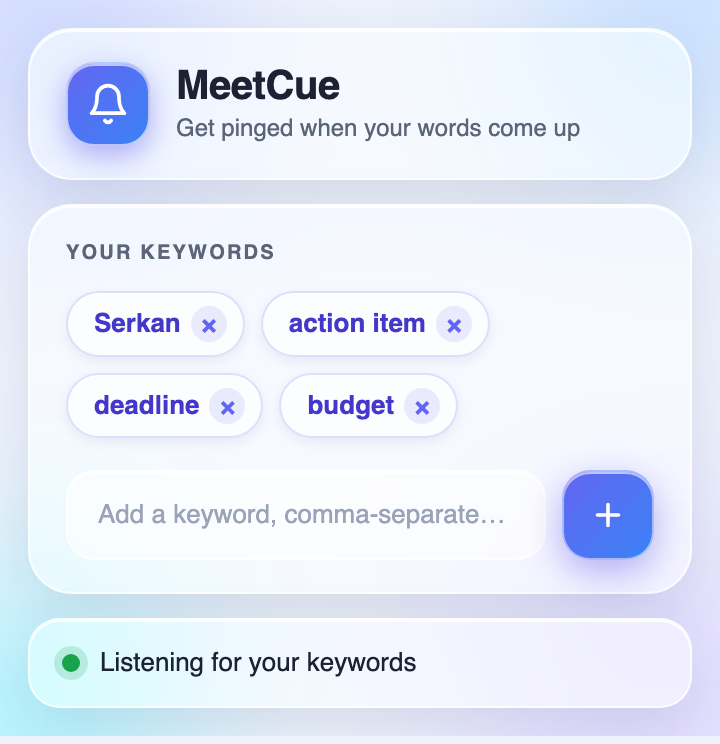

# MeetCue — Google Meet

  
  
  

Keep half-listening to a long meeting? **MeetCue** watches the live captions in Google Meet and fires a desktop notification the moment one of your chosen keywords is spoken — your name, "action item", "any questions", whatever you tell it to listen for.

It is a lightweight Chrome extension (Manifest V3) with no backend, no tracking, and no audio processing of its own.

  

---

## How it works

The extension does **not** transcribe speech. It reads the captions that Google Meet already generates. When Google's caption text contains one of your keywords, the extension raises a Chrome notification.

> Turn on captions in your meeting. No captions on screen → nothing to match → no alerts.
> Recognition quality (accents, background noise, language) is entirely Google's, not the extension's.

## Features

- 🔔 Desktop notification when a watched word appears in the captions
- 📝 Manage your keyword list straight from the toolbar popup
- 💾 Keywords are saved locally and persist between meetings
- 🪶 No servers, no accounts, no telemetry — runs fully in your browser

## Permissions, and why

| Permission | Reason |
| --- | --- |
| `notifications` | To pop the alert when a keyword is heard |
| `storage` | To remember your keyword list across sessions |
| host: `meet.google.com` | To read captions only on Google Meet pages |

## Install (unpacked)

1. Grab the source — download the ZIP from the [releases](https://github.com/srknzcn/meetcue/releases) page, or clone this repo.
2. Unzip it if needed.
3. Open `chrome://extensions` in Chrome.
4. Toggle **Developer mode** on (top-right).
5. Click **Load unpacked** and pick the extension folder.
6. The bell icon appears in your toolbar — pin it for quick access.

## Usage

1. Join any call on `meet.google.com`.
2. Enable captions (the **CC** button in the meeting controls).
3. Click the bell icon and add the words you want to be alerted on.
4. Carry on — you'll get a notification whenever one of them is spoken.

Add or remove keywords any time; changes apply immediately.

## Not getting notifications?

- Make sure captions are actually **on** in the meeting.
- Allow Chrome to show notifications at the OS level:
  - **Windows:** Settings → System → Notifications → Google Chrome
  - **macOS:** System Settings → Notifications → Google Chrome
- Open the page console (F12) and check for errors before [filing an issue](https://github.com/srknzcn/meetcue/issues).

## Contributing

Bug reports, feature ideas, and pull requests are welcome. Open an [issue](https://github.com/srknzcn/meetcue/issues) first so we can talk it through.

## License

Released under the [GNU General Public License v3.0](./LICENSE).
